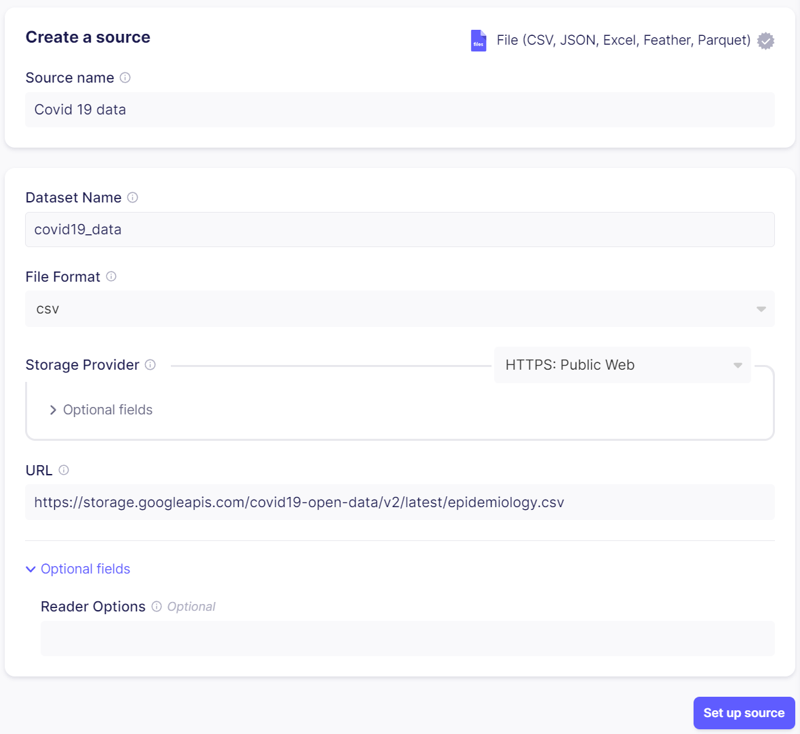
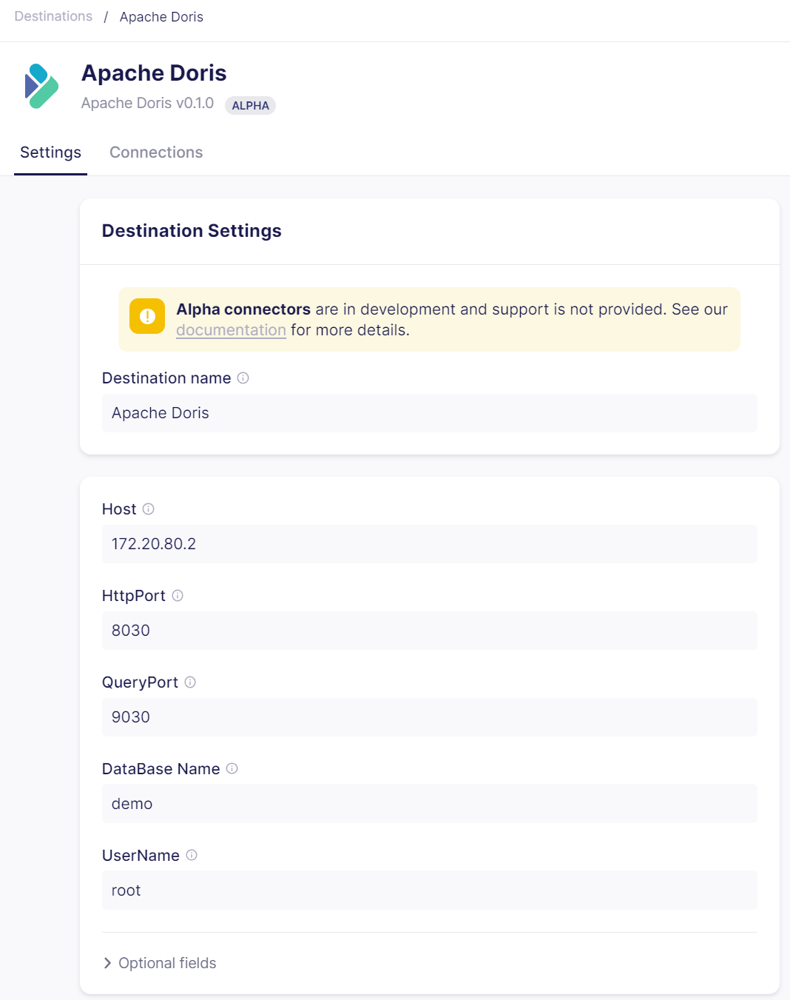
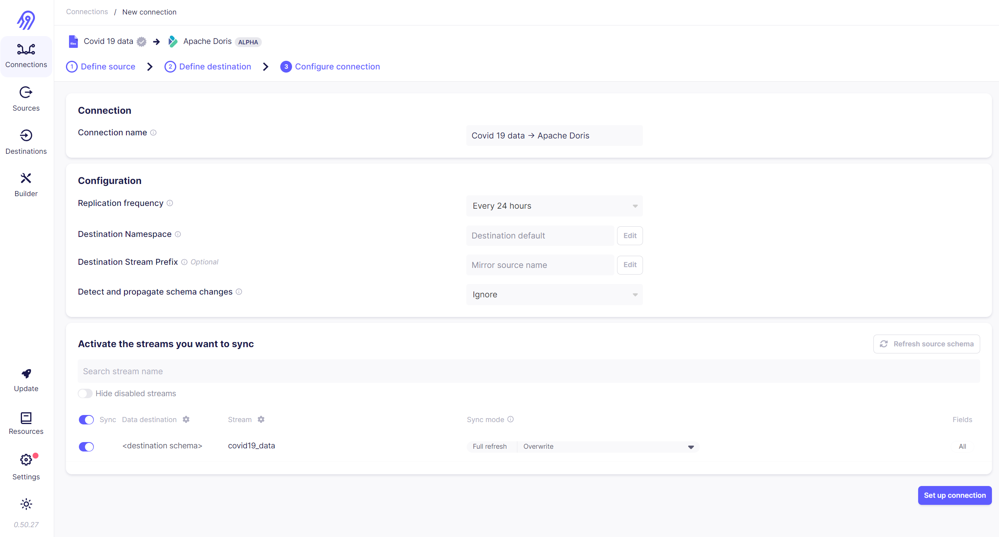
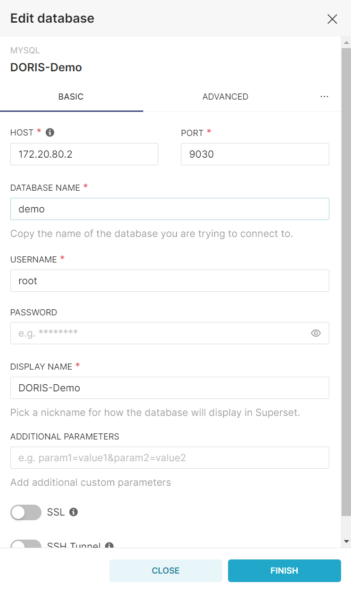
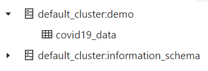

# Open Source Modern Data Stack
This repo demonstrate a comprehensive modern data stack using popular open-source tools.

Welcome to Open Source Modern Data Stack (OSMDS). This repo showcases a complete modern data stack using popular open-source tools.


# Components of the OSMDS
Before we set up project, let's briefly look at each tools used in this example of the open source modern data stack to make sure you understand their components.

# Airbyte
Airbyte is an open-source data integration tool. With Airbyte, you can set up a data pipeline in minutes thanks to its extensive collection of pre-built connectors. Airbyte can replicate data from applications, APIs, and databases into data warehouses and data lakes. Airbyte offers a self-hosted option with Docker Compose that you can run locally. In this example, Airbyte is used to replicate data from a CSV file to Apache Doris.

# Apache Doris
Apache Doris is a high-performance, real-time analytic database base on the MPP (Massive Parralell Processing) architecture and is known for extreme speed and ease of use. It takes only sub-second response time to return query results under massive amounts of data, can support not only highly concurrent point query scenarios, but also high throughput complex analytic scenarios.

# DBT
dbt is an open-source data transformation tool that relies on SQL to build production-grade data pipelines. dbt replaces the usual boilerplate DDL/DML required to transform data with simple modular SQL SELECT statements and handles dependency management. dbt provides a cloud-hosted option and a CLI, a Python API and integration with orchestration tools like Apache Airflow, Dagter, etc. In this OSMDS example, dbt a simple transformation on the ingested data using a SQL query. Airbyte's native integration with dbt is used to run the transformations.

# Apache Superset
Apache Superset is a modern business intelligence, data exploration and visualization platform. Superset connects with a variety of databases and provides an intuitive interface for visualizing datasets. It offers a wide choice of visualizations as well as a no-code visualization builder. You can run Superset locally with Docker Compose or in the cloud using Preset. Superset sits at the end of this real time data analytics stack example and is used to visualize the data stored in Apache Doris.

# Pre-requisites
To follow along, you need to:

**Install Docker and Docker Compose in your machine**. You can follow [this guide](https://docs.docker.com/engine/install/?_gl=1*187dp4*_ga*MTAzNDgyNDI0My4xNjkzNDY2NDcy) to install Docker and [this one](https://docs.docker.com/compose/install/?_gl=1*187dp4*_ga*MTAzNDgyNDI0My4xNjkzNDY2NDcy) to install Docker Compose.

# Using Docker Compose to bootstrap OSMDS
This tutorial uses Docker Compose and a shell script to set up the required resources. Docker saves you from installing additional dependencies locall. You can quickly start and stop the instances.

The shell script **setup.sh** provides two commands, *up* and *down*, to start and stop the instances. The compose files are stored in *airbyte/docker-compose-airbyte.yaml*, *doris/docker-compose-doris.yaml*, and *superset/docker-compose-superset.yaml*. You can go through these files and make any necessary customization, for example, changing the ports where the instances start or installing additional dependencies.

## Setting up Airbyte, Doris, Superset with Docker Compose
### Setting up Airbyte
The script launches the Airbyte instance at *http://localhost:8000*. In this tutorial, you will use the File source to read a CSV file. Enter Covid 19 data as the source name, and select File as the source type. Make sure csv is chosen as the format and paste the following URL in the url field: *https://storage.googleapis.com/covid19-open-data/v2/latest/epidemiology.csv*. Finally, enter the name of the dataset you created in Doris.

> **NOTE:** Login to the Airbyte web UI by entering the default credentials found in .env file.
#### Configuring data source
Enter *Covid 19 data* as source name and select **File** as the source type. Enter the file format and choose HTTPs (Public Web) as the Storage Provider. Finnaly, paste the url of the covid-19 data source. 
<p align="center">
    
</p>

#### Configuring data destination
Choose the **Apache Doris** as data destination. Enter Apache Doris as the name of data destination. Then enter value for the Host, HttpPort, QueryPort, DatabaseName, UserName and Password as below:

<p align="center">
    
</p>

#### Configuring a connection
Finally, you establish a connection between the data source and data destination created above.

<p align="center">
    
</p>

### Setting up Doris
The script launches the Doris FE (front end) instance at *http://localhost:8030*. You can see the following screen, which indicates that the FE has start successfully.

> **NOTE:** Here we use the Doris built-in default user (root) to log in with an empty password.


### Setting up Superset
Once the setup.sh command has completed, visit *http://localhost:8088* to access the Superset UI. Enter admin as username and password. Choose MySQL (use to connect to Doris DWH) from the supported databases drop-down. Then upload the service account keyfile.
<p align="center">
    
</p>

# Using the OSDMS
One the stack is ready and running. You can start using it to ingest and process your data.

## Sync data from CSV into Doris using Airbyte
On the connection screen, you click on the **Sync now** button to start syncing data from online file into the Doris data warehouse. Depending on the size of the source, it might take a few minutes.


Once finished, your Doris UI should show the following structure:

<p align="center">
    
</p>

The **covid19_data** table contains the raw JSON emitted by Airbyte, which is then normalized to form the **final_covid19_data** table. We'll use dbt to transform data. You can take look at the Data preview tab to get an idea of the *final_covid19_data* table structure.


## Do a simple transformation with the dbt
You can use dbt framework to develop transformations.
```sql
{{config(
    materialized='table',
    distributed_by = [],
    properties= {"replication_allocation" : "tag.location.default: 1"}
)}}

with tmp_tbl as (
    SELECT replace(_airbyte_data, '\\', '') _airbyte_data
	FROM {{ source('doris_covid19_data', 'covid19_data') }}
)

SELECT
    get_json_string(_airbyte_data, '$.key') `key`
    , get_json_double(_airbyte_data, '$.total_tested') total_tested
    , get_json_double(_airbyte_data, '$.new_recovered') new_recovered
    , get_json_double(_airbyte_data, '$.new_deceased') new_deceased
    , get_json_string(_airbyte_data, '$.date') `date`
    , get_json_double(_airbyte_data, '$.total_confirmed') total_confirmed
    , get_json_double(_airbyte_data, '$.new_tested') new_tested
    , get_json_double(_airbyte_data, '$.total_recovered') total_recovered
    , get_json_double(_airbyte_data, '$.new_confirmed') new_confirmed
    , get_json_double(_airbyte_data, '$.total_deceased') total_deceased
FROM tmp_tbl
```
Create a aggregated table to get latest covid report by days.
```sql
{{config(
    materialized='table',
    properties= {"replication_allocation" : "tag.location.default: 1"}
)}}

SELECT
    `date`,
    sum(total_tested) total_tested,
    sum(new_recovered) new_recovered,
    sum(new_deceased) new_deceased,
    sum(total_confirmed) total_confirmed,
    sum(new_tested) new_tested,
    sum(total_recovered) total_recovered,
    sum(new_confirmed) new_confirmed,
    sum(total_deceased) total_deceased
FROM {{ ref('stg_covid19_data') }}
GROUP BY 1

```

## Visualize data on dashboard with Superset
Once Airbyte has loaded data into Doris, you can add it as a dataset in Superset and start visualizing data. First, navigate to Dataset page. Select the Doris connection that you created earlier as database, *demo* as the schema and *agg_covid19_data* as the table schema.

Now you can create a new chart using the data stored in the Doris. Navigate to *Charts* tab, choose *agg_covid19_data* as dataset and choose a chart type, example bar chart. On the next page, you can add metrics you want to visualize. Example, I choose simply the sum of *new_recovered*, organized by the key.


## Cleaning up
You can clean up the resources by running the following command.

```bash
./setup.sh down
```

# Conclusion
By adopting an open-source modern data stack, you can achieve remarkable improvements in the efficiency of your data pipeline, resulting in significant time savings by reducing manual labor. Furthermore, this approach can lead to substantial cost reductions. When you choose to employ self-hosted open-source solutions such as Airbyte, Doris, dbt, and Superset, you ensure that these vital components operate within your own infrastructure, offering you greater control and security.

The advantage of these projects lies in their provision of Docker Compose files, which simplifies the local setup process considerably. This means that you can easily establish and manage these components on your local environment with minimal effort.

However, if you're aiming to deploy a scalable modern data stack to a cloud environment, you have the option to leverage Terraform and Kubernetes, two powerful tools that automate the deployment process. This automation not only streamlines the setup but also enables you to efficiently manage and scale your data stack in the cloud environment, providing you with flexibility and ease of use.
## Supporting Links
* <a href="https://airbyte.com/tutorials/modern-data-stack-docker" target="_blank">Set up a modern data stack with Docker</a>

# About the author


